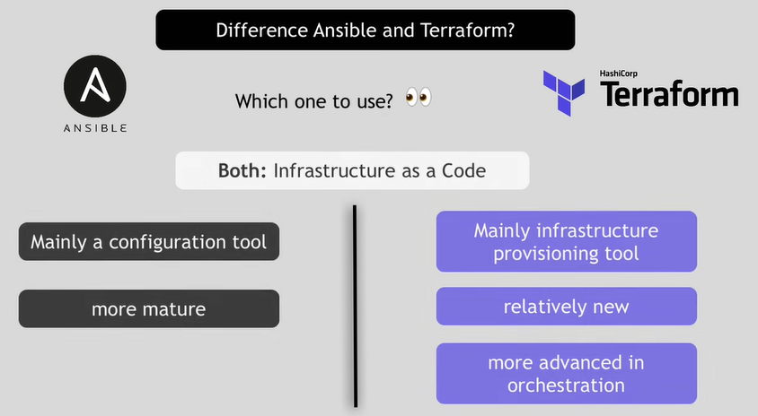

# Terraform

**요약 : Terraform 은 오픈소스로 *HCL(Hashicorp Configure Laguage)로 코드 작성을 통해 인프라를 프로비저닝을 자동화 할 수 있는 IaC (Infra as Code) 툴 입니다.**  

<ins>좀 더 정확히 말하자면 외부 인프라 프로비저닝 서비스와 API를 통해 인프라를 관리한다고 할 수 있을 것 같습니다.</ins>

**Terraform 을 사용하면 서비스에 필요한 인프라들을 코드를 통해 쉽고 빠르게 프로비저닝할 수 있으며, 작성된 코드들을 재사용할 수 있으며 휴먼 에러 발생을 줄일 수 있습니다.** 
그리고, \*Plan , \*Apply 단계를 구분하여
**협업을 통한 코드의 정교함과 다양한 \*프로바이더 지원을하기때문에 인프라 관리는 Terraform을 많이 활용할 것 같습니다**

 

> **Hashicrop Configure Language**   Hashicopr 에서 테라폼으로 인프라를 관리하기 위해 개발한 언어 
> HcL 파일의 확장자는 `.tf` 를 사용합니다.

 

> **Plan stage**   
> 어떤 리소스가 생성되고 수정되고, 삭제될지 계획을 보여주는 단계입니다. (check mode) 
> 출력의 +,-,~ 기호는 git의 diff 명령과 비슷합니다. 
> \+ : 생성 &nbsp;&nbsp;  - : 제거 &nbsp;&nbsp;   ~ : 변경

 

>**Apply stage**  
>테라폼 프로젝트 디렉토리 안래 모든 .tf 파일의 내용대로 리소스를 생성, 수정, 삭제하는 단계입니다.

 

> **Provider**  
> 외부서비스 API와 상호작용하며 리소스를 배포 및 관리를 도와주는 모듈입니다.  
> Hashicrop 에서 지원하는 프로바이더로 AWS, GCP, Azure (Cloud), Vault (Security)... 많습니다.

 

Hashicorp Terraform Provider

   

## Terraform vs Ansible

**공통점**  
- 코드를 통한 인프라 관리
- 인프라 프로비저닝,환경구성,관리작업
- 애플리케이션 배포
  
|Terraform |Ansible|
|--|--|
| 주로 인프라 프로비저닝 | 주로 형상관리|
| 고도화된 오케스트레이션 | 인프라 구성|
|aws,docker 와 함께 작업하기 쉽다 |소프트웨어 설치 |
|IaC 에 더 적합|Configure Mgmt에 더 적합|